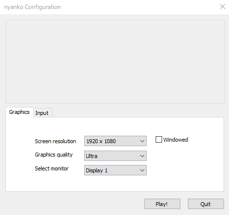

# SaturdayJamboree2019-nyanko

# あそびかた

## 起動方法
①nyanko.exeを起動します。
②以下の設定画面が出てくるので、なにもしないで「Play!」を押します。

## 操作方法
### メニューでの操作
スペースキーで決定、
上下矢印キーで選択です。

現在なにを選択しているかは右下の肉球でわかります。

ゲームをプレイする場合は「スタート」
遊び方をみる場合は「あそびかた」
ゲームを終了する場合は「おわる」
を選択します。

### ゲームプレイ中の操作
スペースキーで「ジャンプ」
のみです。

